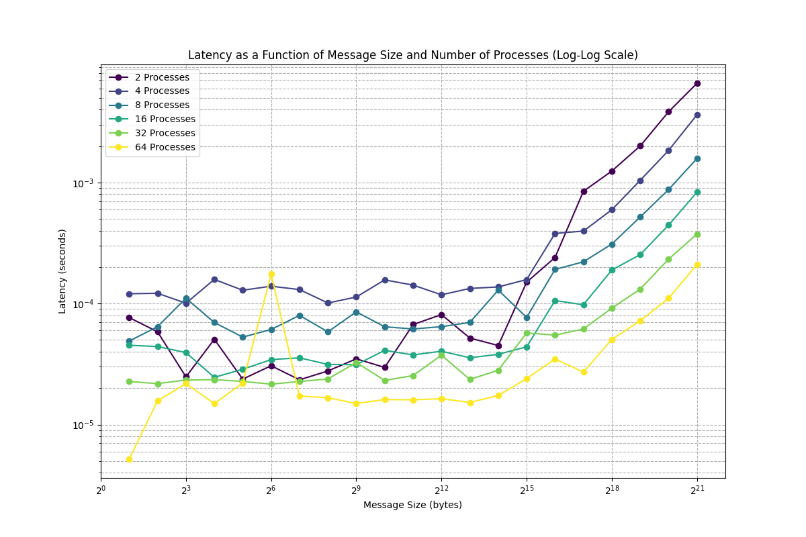
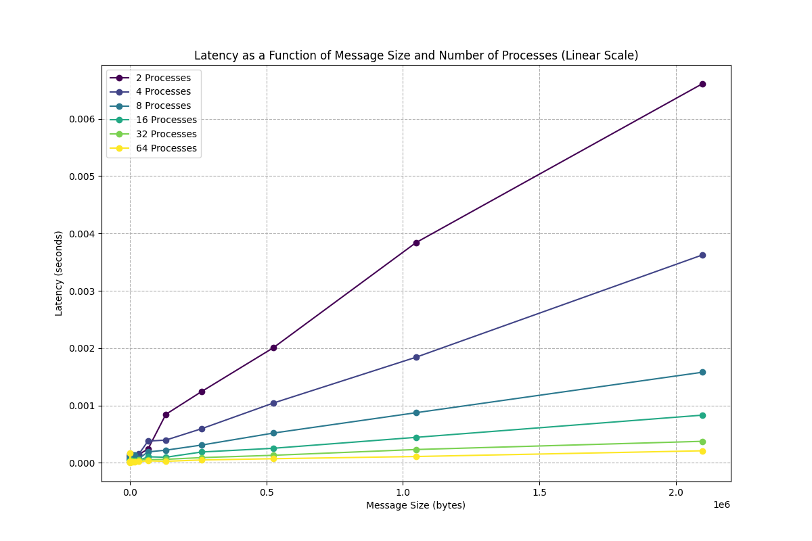

Project 3: Team 5

Part 1:

Part 2:

Part 3:

Here we'll show the bandwidth as a function of message size across the different process counts -- below are plots in log-log and linear scales for better interpretability:

Below is latency as a function of message size across the different process counts

# Part 3 Plots

## Bandwidth as a Function of Message Size and Number of Processes (Log-Log Scale)

## Bandwidth as a Function of Message Size and Number of Processes (Linear Scale)

## Latency as a Function of Message Size and Number of Processes (Log-Log Scale)

## Latency as a Function of Message Size and Number of Processes (Linear Scale)

Part 4:

Below are the outputs replicated from Part 3 but with 

# Part 4 Plots

## Bandwidth as a Function of Message Size and Number of Processes (Log-Log Scale)

## Bandwidth as a Function of Message Size and Number of Processes (Linear Scale)

## Latency as a Function of Message Size and Number of Processes (Log-Log Scale)

## Latency as a Function of Message Size and Number of Processes (Linear Scale)

