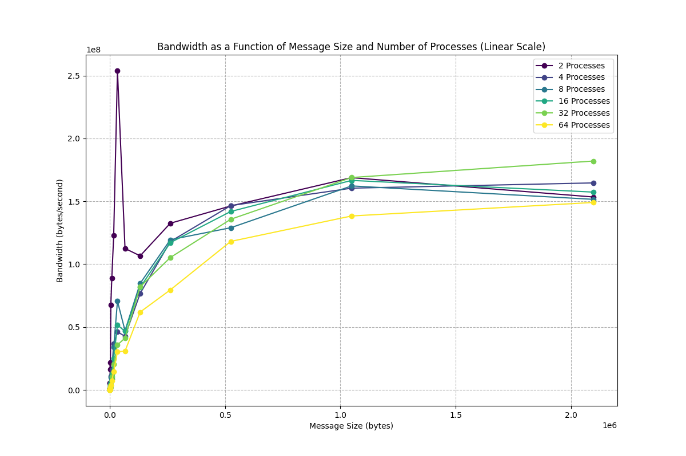
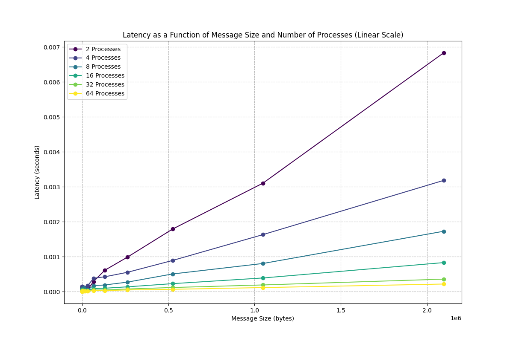

# Project 3: Team 5

## Part 1:

## Part 2:

## Part 3:

In this section, we've implemented the MPI ring shift using the MPI_Sendrcv() commands on a series of different process counts to compute bandwidth as a function of message sizes. Below are plots on log-log scale, as well as linear, for better interpretability. The general trends indicate, with the exception of a processor count of two, a direct increasing power-law relationship between bandwidth and message size. Process count two shows a lot of variability over the message sizes.  Initially, the start-up costs of communication are less for lower process counts, like for process count two, thus showing that they are able to communicate more information at a faster rate than the other process counts.  The main point here being that commnication between two processes can achieve notably higher bandwidth due to fewer communication costs among the different nodes.  Above two process counts, the costs appear to scale relatively similarly.

Below is latency as a function of message size across varying process counts. We see low latency for small messages across all counts, demonstrating efficient small-scale communication. Notably, latency trends—initially low for two processes, increasing through 4 to 16, then decreasing again at 32 and 64, illustrating the trade-off in scaling parallel tasks -- as the number of parallel tasks increases, so does communication overhead, challenging bandwidth efficiency.

## Part 4:

Below are the outputs replicated from Part 3 but with 

