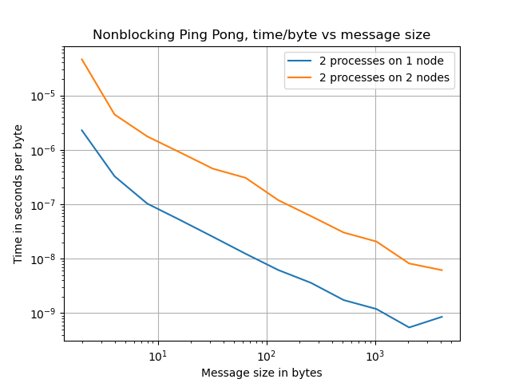
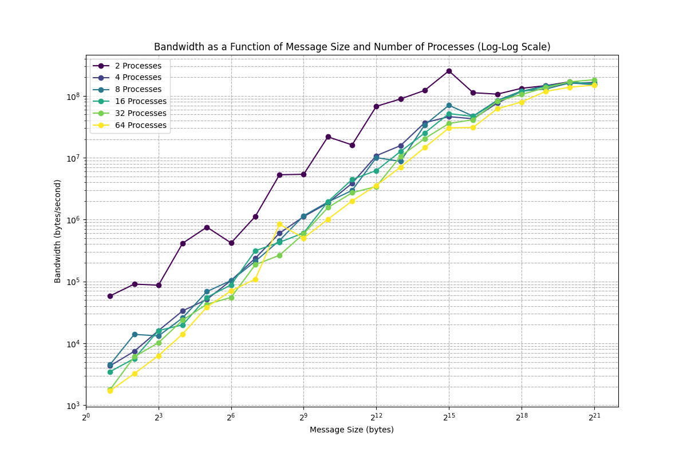
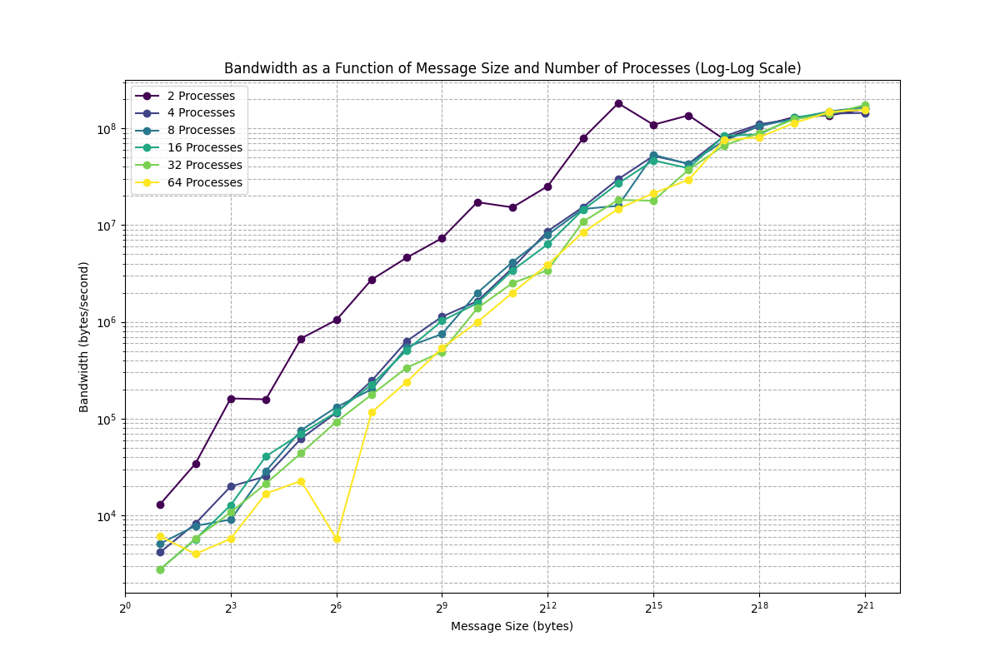
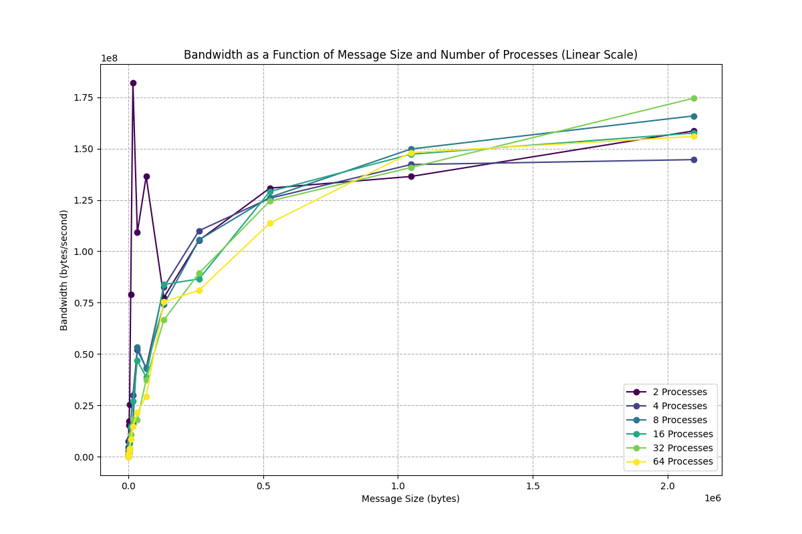

# Project 3: Team 5

## Part 1:

The file corresponding to the blocking Ping Pong is in the Part 1 folder. Basically, we made sure that we have 2 processes, and then the first process sends a message to the second process and waits until the message is received and sent back. The second process waits to receive a message from the first process and then sends it back. For each message size, the total data sent and received in one iteration is 2 times the message size.

We plotted the total time for execution of 100 iterations versus the message size in bytes. We can conclude from this plot that when the 2 processes are on different nodes, the communication takes more time, as it needs to communicate between nodes, which is way slower than communicating inside 1 node.

The other thing we can notice here is that for 2 processes on 1 node, at the very end of the curve, the total time increases which can be because of the allocated space for the message. It might get full if the message is too large, which in turn can increase the execution time.

If we divide the total time by the total amount of bytes, the plot will look like the plot below. It looks like with increasing size of the message, the time of execution per byt of a message decreases. We see the pverflow issue for the message size  (very tail of the plot) for 2 processes on 1 node.

## Part 2:

After doing the same thing for non-blocking Ping Pong, we get the following plots.

For total time of execution:

Per byte:

We can see that the execution becomes a little faster (1 order of magnitude), but the fluctuations in the curve are more visible, this is because of the non-blocking message send/receive, which can be more unpredictable than blocking communication.

## Part 3:

In this section, we've implemented the MPI ring shift with blocking using the MPI_Sendrecv() commands on a series of different process counts to compute bandwidth as a function of message sizes.  For this call, the sending process waits until its task of sending its information to another process is certain to be complete before becoming available again for reuse. Since one process cannot restart until the other is finished and is 'blocked', it can result in slower performance and bottlenecks.

We extended the message sizes to be from 2:2097152 (2^21) instead of 2:4096 because message sizes up to 4096 did not show long-run behavior or distinct differences in latency or bandwidth among the different nodes.  Below are plots on log-log scale, as well as linear, for better interpretability. The general trends indicate, with the exception of a processor count of two, a direct increasing power-law relationship between bandwidth and message size. Process count two shows a lot of variability over the message sizes and significantly higher bandwidth performance for message sizes up to around 4096 bytes.  Under the blocking regime, we see that as the message sizes scale, at least over the range we have plotted, there not clear improvements to bandwidth performance as we scale our process counts.  Initially, the start-up costs of communication are less for lower process counts, like for process count two, thus showing that they are able to communicate more information at a faster rate than the other process counts.  The main point here being that commnication between two processes can achieve notably higher bandwidth (at lower message sizes) likely due to fewer communication costs among the different nodes.  Above two process counts, the efficiency of parallelization appears to scale relatively similarly.
 

Below is the linear-scale plot for blocking calls:

Below is latency as a function of message size across varying process counts. Almost in perfect order we see the latency drop in order of the process count as message sizes increase.  The explanation to this is likely that increased processor counts improve the latency scaling due to the ability to distribute the load of the task more efifciently.

## Part 4:

Below are the outputs replicated from Part 3 under the MPI_Irecv() and MPI_Isend() commands that use non-blocking calls.  In this instance, there is no blocking, thus the communication of information is not dependent on another processes completion, so it can initiate communication to send and recieve at its own speed and will therefore not suffer from bottlenecks of one process limiting the performance/efficiency of another process.  We see that process count two dominates again for message sizes up to approximatley 2^12, but larger process counts begin to have higher behavior in the long-run behavior.  

Below is the log-log scale plot for non-blocking:

Below is the linear scale plot for non-blocking:

Like in Part 3, we see under the non-blocking call regime the same long-run behavior in that there is likely a higher level of overhead communication costs when message sizes are low and process counts are high, but in the long-run, we get lowest latency for higher process counts and the highest for fewer process counts.

